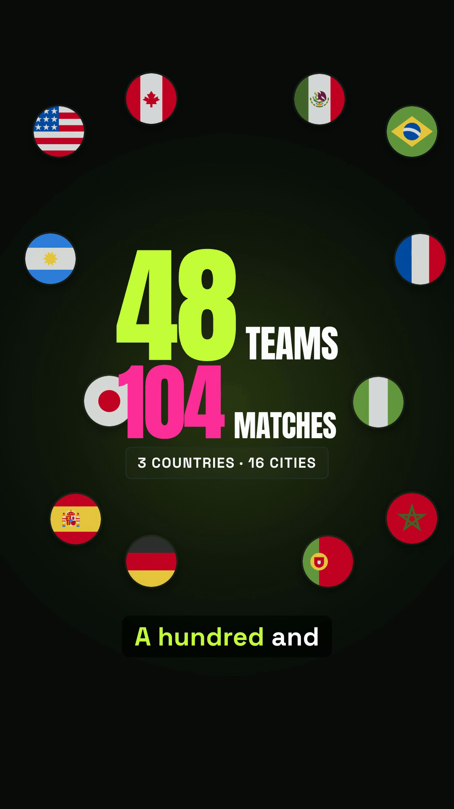
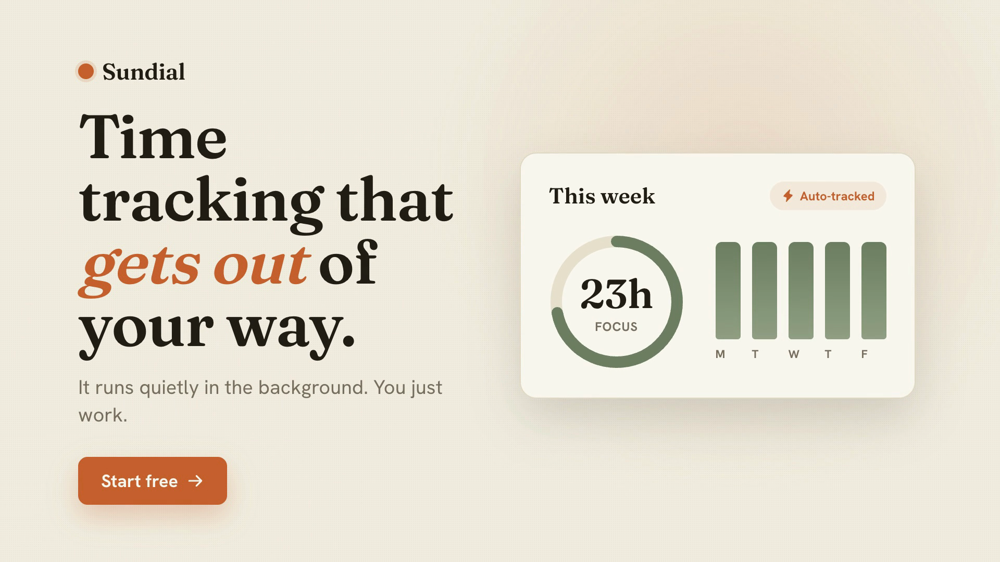
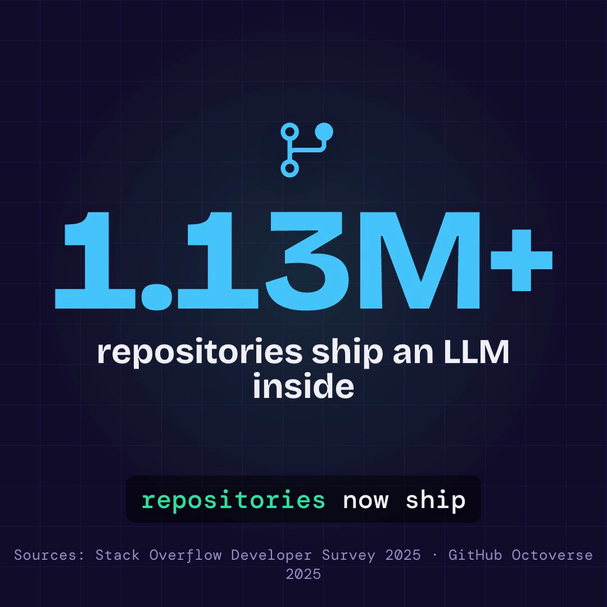

# LLM Video Maker

[](https://skills.sh/GoldLegendW80/llm-video-maker)

Tell your AI coding agent what video you want — it writes the script, designs the visuals, adds
**AI voiceover**, **captions** and music, and renders a finished **MP4**. Generate **TikToks, Reels &
YouTube Shorts, YouTube intros, startup hero videos, product promos, explainers and animated data
visualizations** from a single prompt — a prompt-driven, **Remotion-style** video generator powered by
the [HyperFrames](https://www.npmjs.com/package/hyperframes) engine. Two agent skills for
[skills.sh](https://www.skills.sh) — works with **Claude Code, Cursor, Codex, Windsurf & Gemini**.

## See it work

> **Everything below was generated by this skill — including this reel.**

[](media/reel.mp4)

▶ **[Watch the full 33s reel](media/reel.mp4)** — one line in, a finished MP4 out.

### Three prompts, three completely different videos

| Viral TikTok · 9:16 | Startup hero · 16:9 | Data explainer · 1:1 |
|:--:|:--:|:--:|
| [](examples/worldcup-tiktok/demo.mp4) | [](examples/startup-hero/demo.mp4) | [](examples/data-explainer/demo.mp4) |
| funny · captions · TTS | calm · music-only · loop | cited stats · animated charts |

Same skill, three formats, three tones. Each is a real render in [`examples/`](examples/) with its
`brief.json` — click a poster to play the MP4.

## 1. Install

```bash
npx skills add GoldLegendW80/llm-video-maker
```

That's it. This copies both skills into your agent (Claude Code, Cursor, Codex, Windsurf, …).

## 2. Use

Just ask your agent:

```
/make-video "30s square promo for my app — funny, high energy, French voiceover"
```

…or give it a JSON brief. To change one part of a finished video:

```
/edit-video <project-id> <chapter> "make the intro punchier"
```

**You don't download or wire up anything by hand — the skill sets up its own tools the first time it
runs.** Output lands in `projects/<id>/` (the MP4, plus every intermediate file, so runs are
resumable).

## Capabilities — sources & assets

**Turn almost anything into a video:**
- an inline description or a JSON brief
- a **topic** — researched live on the web, every on-screen fact grounded
- a **script** — full creative interpretation
- a **codebase** — analyzed into facts, turned into a product/feature video
- **your own recording** + transcript — captions sync to *your* voice (transcript-locked mode)

**Pull in real media (the omnivorous asset stage):**
- **Live screen recordings via Playwright** — the `capture` type drives your real Chrome over any URL
  (including `localhost`) with scripted scroll / click / type / hover, and records a real demo of your
  app or site straight into the video
- **Stock photos & video b-roll** (Pexels / Pixabay) · **GIFs** (Giphy / Tenor) · **sound effects**
  (Freesound, CC0) · **memes** (imgflip)
- **Real brand logos** (simple-icons) · **275k+ icons** (Iconify) · country flags
- **AI image generation** (OpenAI / fal) — or styled on-palette placeholders
- **Any web asset by URL** (license-tracked) · **code snippets** rendered with Shiki syntax
  highlighting · **background removal** for transparent cut-outs

**Audio:** AI voiceover (Kokoro TTS, multilingual) or OpenAI TTS or your own recording · word-synced
captions (15 styles) · music · ducked sound effects.

**Output:** any platform — TikTok / Reels / Shorts (9:16), YouTube (16:9), square (1:1) or custom
W×H · deterministic, validated render · 4K supersample · chaptered, so you can re-edit one section
with `/edit-video`.

Every asset is vendored locally with its license — nothing hits the network at render time.

## What the skill pulls in for you (automatic, first run)

| What | Where | Why |
|------|-------|-----|
| HyperFrames engine `hyperframes@0.6.91` | your project's `node_modules/` | renders the HTML composition into an MP4 |
| Companion skills (hyperframes, gsap, css-animations…) | `.agents/skills/` (gitignored) | authoring know-how the pipeline reads |
| Icons, brand logos, stock media, captions | `projects/<id>/assets/` | the on-screen visuals, saved locally with their licenses |

Everything is fetched at build time and reused after. **Nothing accesses the network while rendering.**

## What you need on your machine first

Three system tools the skill can't install for you (it checks them and stops early if one is missing,
via `npx hyperframes@0.6.91 doctor`):

- **Node ≥ 22** · **FFmpeg** · **Google Chrome**

macOS: `brew install node ffmpeg` and install Chrome normally.

## AI voiceover (optional)

Narration uses a **local, offline** text-to-speech model (Kokoro — no API key, nothing leaves your
machine). **The agent sets this up itself.** The only one-time cost is a ~80 MB voice-model download
the first time, which the agent runs or walks you through — it won't silently stall a render.

Don't want voiceover? Skip it entirely — use music + captions, or supply your own recording.

## Optional — richer assets (free API keys)

Set any of these in your environment and the pipeline grabs real media instead of styled placeholders.
All have free tiers; skip them and it still produces a finished video from built-in icons + logos.

| Key | Unlocks |
|-----|---------|
| `PEXELS_API_KEY` / `PIXABAY_API_KEY` | stock photos + video b-roll |
| `GIPHY_API_KEY` / `TENOR_API_KEY` | reaction gifs |
| `FREESOUND_API_KEY` | CC0 sound effects |
| `OPENAI_API_KEY` + `IMAGE_GEN=openai` | AI image generation |

## The two skills

| Skill | Trigger | What it does |
|-------|---------|--------------|
| **make-video** | `/make-video <brief.json \| description>` | brief → research → design → storyboard → assets → compose → validate → MP4 + report |
| **edit-video** | `/edit-video <id> <chapter> '<instruction>'` | re-renders only the scenes in one chapter of a finished video |

Input format: [`skills/make-video/schema.json`](skills/make-video/schema.json). Required fields are just
`id`, `platform`, `story`, `source` — everything else (voiceover, captions, music, style) is optional.

## What it can make

From one prompt each (the [examples](examples/) above were all generated this way):

- **Social video** — TikTok, Instagram Reels, YouTube Shorts (9:16) with captions + AI voiceover
- **YouTube intros & promos** (16:9) — launches, channel intros, product spots
- **Startup / website hero loops** — clean, muted, autoplay-ready
- **Explainers & data visualizations** — animated charts, counters, cited stats
- **Square social posts** (1:1) for feeds

Every render is deterministic, captioned, and uses licensed assets with local AI narration.

## FAQ

**How do I generate a video with Claude Code (or Cursor / Codex)?**
Install the skill, then ask your agent: `/make-video "describe the video you want"`.

**Is this a Remotion alternative?**
Same idea — video rendered from code — but prompt-driven end to end. Your agent writes the HTML/GSAP composition; you just describe it.

**Can it make TikToks, Reels and YouTube Shorts?**
Yes — vertical 9:16 with word-synced captions, plus 16:9 (YouTube) and 1:1 (square).

**Does it add voiceover and subtitles?**
Yes — local, offline AI text-to-speech (Kokoro) and word-synced captions.

**Which AI agents are supported?**
Claude Code, Cursor, Codex, Windsurf, Gemini, Cline and more — anything [skills.sh](https://www.skills.sh) installs into.

**Is it free and open source?**
Yes — MIT licensed.

## Responsible use

You're responsible for the claims, brand marks, and legal disclaimers in whatever you generate (e.g.
gambling or finance ads need jurisdiction-specific age/risk warnings). The pipeline grounds on-screen
facts and tracks each asset's license, but rights clearance and compliance are on you.

## Credits (demo assets)

The bundled demo videos were generated by this skill. Their assets:

- **Music** — Kevin MacLeod ([incompetech.com](https://incompetech.com)): *Hyperfun*, *Pamgaea*, *Exhilarate* — CC-BY 4.0.
- **Voiceover** — Kokoro-82M, run locally (no API).
- **Icons / flags** — [Iconify](https://iconify.design) (game-icons, MDI, Phosphor, circle-flags). **Fonts** — Google Fonts (OFL).
- **Data-explainer figures** are real and cited on screen: [Stack Overflow Developer Survey 2025](https://survey.stackoverflow.co/2025) · [GitHub Octoverse 2025](https://github.blog/news-insights/octoverse/). The World Cup facts are real; *"Sundial"* is a fictional demo brand.

## License

MIT — see [LICENSE](LICENSE).
